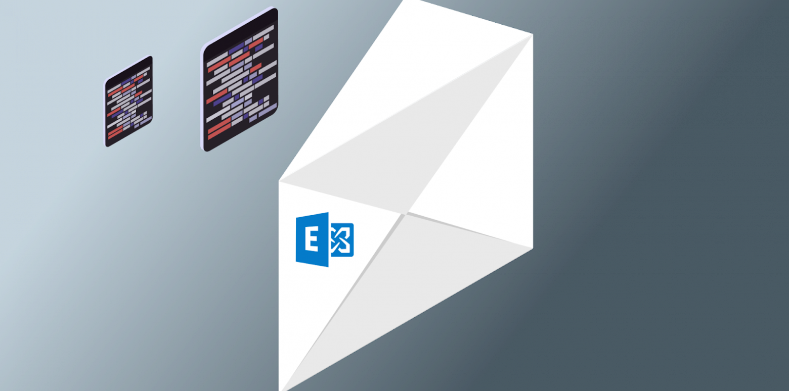
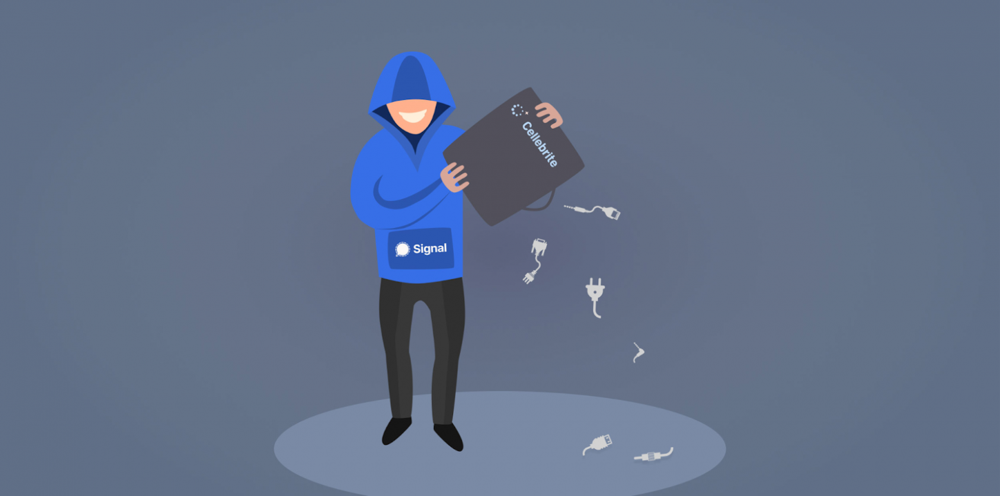
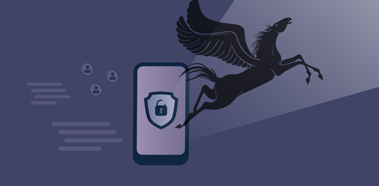
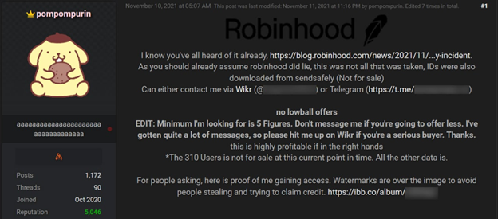
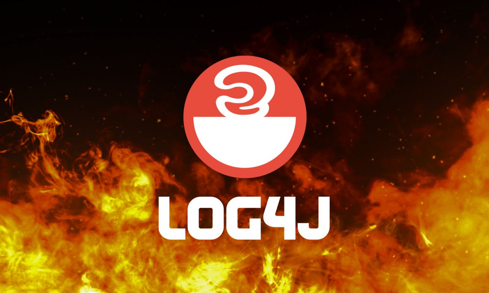

# Самые громкие события инфосека за 2021 год

2021 пообещал много веселья ещё до того, как начался: за пару недель до его наступления выяснились детали масштабной атаки на SolarWinds, которую будут разбирать еще полгода. Под катом мы подводим итоги ушедшего 2021 в примечательных ИБ-событиях каждого месяца.

## Январь. WhatsApp и SolarWinds

Смена политики конфиденциальности WhatsApp. WhatsApp предложил пользователям или согласиться передавать свои данные Facebook, или уходить. Многие и ушли: кто в Telegram, кто в Signal, кто к другим конкурентам. 

Последствия SolarWinds. Постепенно начали осознавать последствия взлома SolarWinds, Microsoft и VMWare. Хакеры смогли собрать данные более 300 тысяч клиентов SolarWinds, среди которых корпорации из Fortune 500 и американские правительственные агентства. Данные, конечно, вскоре разлетелись на продажу на теневых форумах.

## Февраль. Киберпанк и «бесплатные» VPN

Взлом водоочистительной системы. Во Флорида-Сити неизвестный хакер взломал компьютер городской водоочистительной системы — она почему-то была подключена к интернету. Залогинившись во второй раз, он изменил в настройках значение одного из химикатов на такое, что могло бы причинить серьезный ущерб здоровью людей. К счастью, это вовремя заметили и исправили.

Бесплатная VPN-мышеловка. Данные пользователей трёх популярных VPN-сервисов — GeckoVPN, ChatVPN и SuperVPN — выставили на продажу. В сумме набралось более 21 миллионов записей, среди которых почтовые адреса и серийные номера их устройств. Такое вот напоминание о том, что бесплатного почти ничего не бывает: если что-то дают бесплатно, то товар — это почти наверняка вы.

## Март. ProxyLogon

В Microsoft Exchange обнаружили 4 уязвимости, которые активно эксплуатировали китайские группировки. Атаки к тому моменту продолжались с января, так что к моменту выхода патча пострадало под 30 тысяч организаций.

Пожалуй, крупнейшая связанная с этой историей атака — взлом корпоративной сети Acer, у которой за расшифровку данных группировка REvil вымогала от 50 до 100 миллионов долларов.

## Апрель. Signal vs Cellebrite

Компания Cellebrite создает продукты, которые позволяют вытягивать с мобильных устройств данные и переписки. В апреле они сообщили, что теперь научились работать с известным мессенджером Signal. Signal в ответ не растерялись и опубликовали беззаботно-ехидный пост о том, что новые версии Signal теперь умеют ломать репорты Cellebrite по устройству, добавляя туда произвольные данные и удаляя уже собранные. 

## Май. Атака на Colonial Pipeline

7 мая Colonial Pipeline, оператор крупнейшего в США нефтепровода, пострадал от ransomware-атаки. Из-за этого им пришлось временно приостановить работу, и вскоре страна объявила чрезвычайное положение — взлом поставил под угрозу половину поставок топлива на восточное побережье США. Ответственными за взлом назвали группировку Darkside, которая вскоре гордо подтвердила свою причастность.

## Июнь. Начало блокировок VPN и взлом EA

Блокировка VPN. Роскомнадзор начал серию блокировок VPN — первыми пали VyprVPN и встроенный VPN Opera. Разработчики браузера оперативно убрали из российской версии доступ к своему VPN-сервису, и больше их не трогали. 

Взлом Electronic Arts. В США некие хакеры взломали Electronic Arts и выложили на продажу исходники Frostbite и FIFA 21. Взломали изобретательно: купили слитые куки для корпоративного Слака компании, залогинились и пожаловались во внутреннюю техподдержку, что потеряли телефон на последней вечеринке и не могут теперь никуда зайти. Поддержка посочувствовала да выдала им доступы, и находчивые любители вечеринок отправились собирать материал.

## Июль. Взлом Kaseya и Pegasus

Взлом Kaseya. Группировка REvil отметилась взломом Kaseya VSA, провайдера софта для мониторинга ИТ-инфраструктуры. В сумме они смогли зашифровать данные сотен американских компаний, у которых вскоре начали вымогать за расшифровку данных от $45000 до $5 миллионов в XMR. 

Пегасус. Отсюда берёт начало громкая Пегасус-эпопея — о NSO Group впервые заговорили все крупные медиа, а Apple срочно взялась за устранение всех уязвимостей, которые спайварь использовала. Напомню, речь об уязвимостях, которые позволяли заражать iOS-устройства шпионским софтом через СМСку в iMessages, без какого-либо участия жертвы.

## Август. Кража $600 млн и взлом T-Mobile

Похищение $600 миллионов. Анонимный хакер поставил новый рекорд в истории криптовалютной преступности — украл у китайской Poly Network крипты на сумму больше 600 миллионов долларов. В основном это токены на Ethereum, BSC и Polygon Network. Вскоре больше половины хакер вернул, заявив, что не очень-то и нужны ему были деньги, а взламывал и вовсе из спортивного интереса.

Взлом T-Mobile. Ещё в США взломали одного из крупнейших операторов связи, T-Mobile. Треть украденной базы данных выложили на продажу за 6 биткоинов (около 285 тысяч долларов на тот момент). Во всей базе в целом собраны данные около 100 миллионов клиентов: даты рождения, номера водительских лицензий и номера социального страхования. Этих данных достаточно, например, чтобы взять на жертву кредит или ввязать в иные крупные неприятности.

Наконец, в конце августа начал бушевать ботнет Meris, деятельность которого далее плавно перекочевала в сентябрь.

## Сентябрь. Ботнет Meris

В начале сентября Meris достиг пика своей активности, побив рекорды рунета по масштабам атаки — целью стал Яндекс, который устоял, но с большим трудом. Атака достигала максимальной мощности в 20-21 миллионов запросов в секунду. Ещё атаковали Сбер и ВКонтакте, а за рубежом досталось Cloudflare. Эксперты полагают, что ботнет включает порядка 200 000 устройств производства MikroTik.

## Ноябрь. Взлом ФБР и суд над NSO Group

Суд над NSO Group и уведомления для жертв Пегасуса. В ноябре Apple наконец-таки подала на NSO Group в суд за незаконную слежку, заодно пообещав, что теперь будет уведомлять своих пользователей, если заметит на их устройствах следы Пегасуса. Вскоре первые уведомления нашли своих адресатов в Таиланде, Эль Сальвадоре, Уганде и Польше. Среди них политические исследователи, преподаватели, журналисты и прокурор, а также члены американского Госдепартамента.

Минобороны Израиля вскоре подрезало список стран, в которых информационно-безопасностные компании страны могут экспортировать свои продукты. В новый список включили только безукоризненные демократии из ЕС и Five Eyes, а также Индию — видимо, на вырост. 

Взлом ФБР и Robin Hood. Тем временем, в США известный хакер pompompurin взламывает компанию Robin Hood и ФБР. У первых взломщик забирает клиентские данные, которые вскоре оказываются на продаже в даркнете. С почты же ФБР он массово рассылает на почты сисадминов письма с советами перепроверить и усилить безопасность своих систем: мол, на них нацелился известный злостный хакер Винни Троя (на самом деле видный ИБ-специалист). 

## Декабрь. Log4Shell

Если следите за ИБ, всё знаете и так: да, Log4j, она же Log4Shell. Масштабная и вездесущая уязвимость в популярной библиотеке, с которой мы будем разбираться еще много лет и которая уже успела стать чем-то вроде нашей затянувшейся пандемии от мира ИБ — всем уже вусмерть надоело и никого уже не удивишь. 

Log4j воспользовались все хакерские группировки, её активно используют для установки криптомайнеров, а попытку взлома на себе испытала половина всех мировых организаций. Что уж там, мы Log4j даже на Марс ухитрились отправить: злосчастную библиотеку использует вертолёт Ingenuity. 

Остаётся нам надеяться, что 2022 не преподнесёт иных масштабных сюрпризов — и этих с лихвой хватило.

## Теги: [дайджест,](https://habr.com/ru/search/?target_type=posts&order=relevance&q=%5Bдайджест%5D) [информационная безопасность,](https://habr.com/ru/search/?target_type=posts&order=relevance&q=%5Bинформационная%20безопасность%5D) [события](https://habr.com/ru/search/?target_type=posts&order=relevance&q=%5Bсобытия%5D)
## Хабы: [Блог компании T.Hunter,](https://habr.com/ru/company/tomhunter/blog/) [Информационная безопасность](https://habr.com/ru/hub/infosecurity/)
